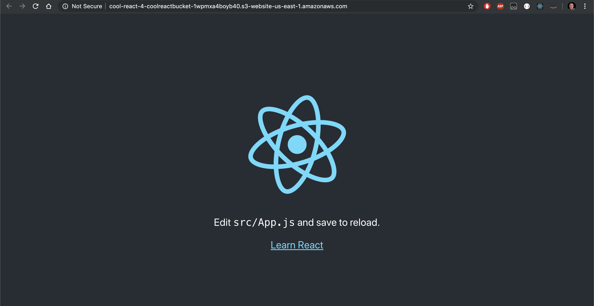

# cool-react-app

## Team Members

Vinh, Devon, Paolo, Peter

## Troubleshooting

### AWS-1.YML

- Problem: 
  - Resource name "cool-react-bucket" is not alpha-numeric
- Solution: 
  - replace all "cool-react-bucket" with coolreactbucket

### AWS-2.YML

- Problem: Resources within S3 bucket were not publicly accessible
- Solution: Added a changed in the post-build commands section: private to  public-read

### AWS-3.YML

- Problem: CloudFormation stack was not attaching to GitHub 
- Solution: Inside of Source -> Configuration, changed:
"Owner: GithubOwner 
Repo: GithubRepo" 
to 
"Owner: !Ref GithubOwner 
Repo" !Ref GithubRepo:

### AWS-4.YML

- Problem: Missing CodeBuild and CodePipelineRole code
- Solution: Adding missing blocks of code.

### AWS-5.YML

- Problem: 
  - Error: Didn't copy build folder recursively, 
  - Error: DistributionConfig:Origins did not match array type
  - Error: Pipeline should start with a stage that only contains source actions 
- Solution: 
  - add recursive to aws s3 command, 
  - add "-" before Origins for array.
  - change source action to source

### AWS-6.YML
- Problem: Template format error: Resource name cool-react-bucket is non alphanumeric
- Solution: got rid of "-" between the words

- Problem: Template format error: 2020-09-09 is not a supported value forAWSTemplateFormateVersion
- Solution: Changed year to 2010

- Problem: Resource Join ['', [!GetAtt coolreactbucket.Arn, "/*"]] must be in ARN format
- Solution: Add a "!" before Join
  
- Problem: Invalid principal in policy: "SERVICE":"codepipeiine.amazonaws.com" (typo)
- Solution: Fixed the typo in "pipeline"

- Problem: prebuild and postbuild commands were not in the right format/
-Solution: added undersocres i.e pre_build

- Problem: ViewerProtocolPolicy was set to http instead of https
- Solution: changed it to https
